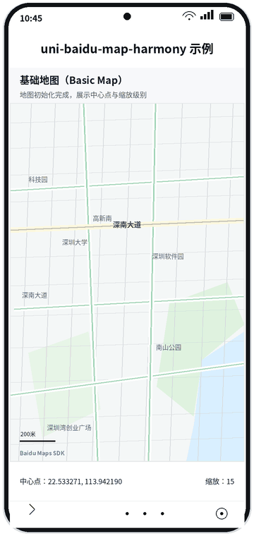
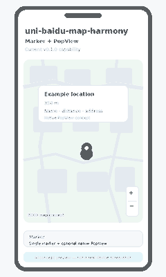
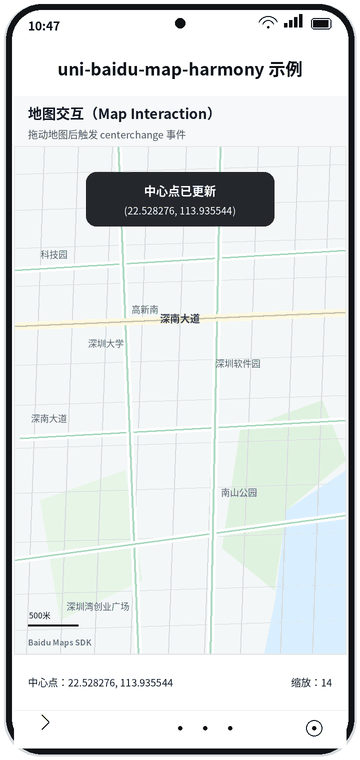

# uni-baidu-map-harmony

An open-source HarmonyOS NEXT native map embed for uni-app and UTS.

> English is the default language. Expand the Chinese section at the end for
> the Chinese documentation.

This repository contains the adapter layer that registers a native
`<embed tag="baidu-map" />` component and connects it to Baidu's HarmonyOS
NEXT map SDK. The host application remains responsible for business state,
location permissions, coordinate conversion, navigation, and privacy-policy
UI.

## Concept previews

> The images below are AI-generated concept previews of the current v0.1.0 capabilities. They are **not HarmonyOS device-verification screenshots**. Real-device rendering still requires a legally obtained Baidu HAR, a valid AK, matching package/signature configuration, and a compatible uni-app/HBuilderX host project.
>
> 下图为 AI 生成的功能概念预览，并非 HarmonyOS 真机验证截图。真实渲染效果仍需在具备合法百度 HAR、有效 AK、匹配包名/签名及兼容 uni-app/HBuilderX 环境的真机项目中验证。

<p align="center">
  
  
  
</p>

## Why this project exists

The official uni-app HarmonyOS documentation currently lists Tencent Maps for
the built-in `map` component. It does not provide a Baidu Maps option for the
traditional `uni-app` + `APP-HARMONY` path. This project fills that specific
gap by exposing Baidu's HarmonyOS NEXT native map SDK through UTS and
`defineNativeEmbed`.

See the official [HarmonyOS built-in module documentation](https://uniapp.dcloud.net.cn/tutorial/harmony/built-in-module.html),
[map platform differences](https://uniapp.dcloud.net.cn/component/map), and
[native embed documentation](https://uniapp.dcloud.net.cn/tutorial/harmony/native-component.html)
for the surrounding platform capabilities.

> The wrapper code in this repository is MIT-licensed. The Baidu SDK is a
> separate third-party dependency and is not covered by the wrapper license.
> See [THIRD-PARTY-NOTICES.md](THIRD-PARTY-NOTICES.md).

## Features

- HarmonyOS NEXT and `APP-HARMONY` only.
- Native `<embed tag="baidu-map" />` registration through `defineNativeEmbed`.
- Lazy, process-wide SDK initialization with a concurrent initialization guard.
- Explicit privacy-consent input before SDK initialization.
- Configurable BD09 map center and zoom level.
- Debounced `centerchange` events after map gestures.
- Optional single marker with an optional native `PopView` containing a name,
  distance, and address.
- No dependency on a host app's pages, business state, APIs, images, or
  location plugin.

## Non-goals

This plugin does not provide:

- H5 or WeChat map rendering.
- Device location or location permission requests.
- WGS84/GCJ02/BD09 coordinate conversion.
- Reverse geocoding, POI search, route planning, or navigation.
- A privacy dialog or a host application's privacy-policy implementation.

## Requirements

- A uni-app project that targets HarmonyOS NEXT.
- A recent HBuilderX/uni-app toolchain with native embed support. The official
  uni-app documentation introduced Harmony native embed support in HBuilderX
  4.62; verify the toolchain used by your application before integrating.
- HarmonyOS SDK/API level 12 or newer.
- A Baidu Maps HarmonyOS SDK AK whose package name and signing information
  match the host application.
- A legally obtained copy of the vendor HAR referenced by
  `utssdk/app-harmony/config.json`.

## Configuration

Configure the plugin in the host uni-app project before using the native embed:

- `apiKey`: read the Baidu Maps AK from the host app's environment, for example
  `VITE_BAIDU_MAP_HARMONY_KEY`; never commit a real AK.
- `privacyAgreed`: keep `false` until the host app has completed its privacy
  consent flow, then update it to `true`.
- `oaidEnabled`: keep `false` unless OAID collection is required and disclosed;
  add `ohos.permission.APP_TRACKING_CONSENT` only for that opt-in flow.
- `center` and `zoom`: provide the initial map center in BD09 coordinates and
  the initial zoom level.
- `defaultMarkerIcon` and `marker`: optionally configure a `rawfile://` marker
  icon and marker data. The marker can provide `lat`, `lon`, `icon`, `name`,
  `distance`, and `address`.
- Host-app permissions: add the SDK's required Harmony permissions to the host
  app; this plugin does not edit the generated host project.

See [Usage](#usage) and [Options and events](#options-and-events) for the
complete example and option details.

## Installation

### 1. Copy the plugin into the uni-app project

Copy the contents of this repository into:

```text
<your-uni-app-project>/src/uni_modules/uni-baidu-map-harmony/
```

The resulting plugin directory must contain `package.json` and `utssdk/`.

### 2. Add the Baidu SDK HAR locally

The repository intentionally does not commit the 47 MB vendor binary. Obtain
the SDK from Baidu's official distribution or from a source whose
redistribution terms you have verified, then place the file at:

```text
src/uni_modules/uni-baidu-map-harmony/utssdk/app-harmony/libs/navi_map-2.0.5.har
```

The current adapter targets the `@bdmap/navi_map` 2.0.5 HAR declared by this
repository. Baidu's current product page also lists the `@bdmap/map` 2.0.5
package. Do not silently substitute a different package: confirm its exported
symbols and update `config.json` and imports together if you choose to migrate.

Run the repository check from this directory:

```bash
node scripts/verify-sdk.mjs --require-sdk
```

### 3. Register Harmony permissions in the host app

The plugin does not edit the host application's generated Harmony project.
Add the permissions required by the SDK to the host app's Harmony module
configuration. At minimum, the Baidu compliance guide identifies these map
permissions:

```json5
{
  "requestPermissions": [
    {
      "name": "ohos.permission.INTERNET"
    },
    {
      "name": "ohos.permission.GET_NETWORK_INFO"
    }
  ]
}
```

Only add `ohos.permission.APP_TRACKING_CONSENT` when your app has chosen to
enable OAID collection and has completed the corresponding disclosure and
consent work. This adapter defaults `oaidEnabled` to `false`.

### 4. Obtain and protect an AK

Create a HarmonyOS SDK application in the Baidu Maps console. The AK must be
configured for the host app's package name and signing information. Keep it in
the host app's environment or release configuration; do not commit a real AK
to this repository.

## Usage

Import the plugin for its registration side effect, then use the native embed
on the Harmony branch:

```vue
<template>
  <view class="map-page">
    <!-- #ifdef APP-HARMONY -->
    <embed
      class="map"
      tag="baidu-map"
      :options="mapOptions"
      @ready="handleMapReady"
      @centerchange="handleCenterChange"
    />
    <!-- #endif -->
  </view>
</template>

<script setup>
import { ref } from 'vue'
import '@/uni_modules/uni-baidu-map-harmony'

const mapOptions = ref({
  apiKey: import.meta.env.VITE_BAIDU_MAP_HARMONY_KEY,
  // Set this to true only after the host app's privacy policy has been
  // explicitly accepted by the user.
  privacyAgreed: false,
  oaidEnabled: false,
  center: {
    lat: 22.147624,
    lon: 113.580231,
  },
  zoom: 16,
})

function handleMapReady(event) {
  if (event?.detail?.err) {
    console.error('Baidu Map failed to initialize:', event.detail.err)
  }
}

function handleCenterChange(event) {
  const { lat, lon } = event.detail
  console.log('Map center in BD09:', lat, lon)
}

// Call this after the host app's privacy consent flow completes:
// mapOptions.value = { ...mapOptions.value, privacyAgreed: true }
</script>

<style>
.map-page,
.map {
  width: 100%;
  height: 100%;
}
</style>
```

The host app should own the consent state. Passing `privacyAgreed: false`
prevents SDK initialization and reports an error through `ready`; changing it
to `true` allows the embed to initialize without remounting the page.

## Demo and verification

The focused [basic-map.vue example](examples/basic-map.vue) shows the complete
embed registration, privacy-consent transition, center-change event handling,
and host-side configuration flow. To run it, add the legally obtained HAR,
configure the AK, register the required Harmony permissions, and open the
example from a real HarmonyOS-capable uni-app host project.

The repository intentionally does not include the vendor HAR or a real AK.
Source validation can run without them, but map rendering and device behavior
remain unverified until the host project supplies both and performs a real
HarmonyOS build.

## Marker usage

`marker` is optional. When it is supplied, the host app must provide a marker
image through `icon` or `defaultMarkerIcon`. The image path must be valid in
the host app's Harmony `rawfile` resources.

```js
const mapOptions = ref({
  apiKey: import.meta.env.VITE_BAIDU_MAP_HARMONY_KEY,
  privacyAgreed: true,
  oaidEnabled: false,
  defaultMarkerIcon: 'rawfile://marker.png',
  center: { lat: 22.147624, lon: 113.580231 },
  marker: {
    lat: 22.147624,
    lon: 113.580231,
    icon: 'rawfile://marker-icon.png',
    name: 'Example location',
    distance: '350 m',
    address: 'Example address',
  },
})
```

When marker data changes, the previous marker is removed before the new marker
is added. In-flight marker updates are guarded so an older update cannot leave
an obsolete marker visible.

## Options and events

### `options`

| Option | Type | Default | Description |
| --- | --- | --- | --- |
| `apiKey` | `string` | required | Baidu Maps HarmonyOS SDK AK. |
| `privacyAgreed` | `boolean` | `false` | True only after host consent. |
| `oaidEnabled` | `boolean` | `false` | Whether the SDK may use OAID. |
| `center` | `{ lat, lon }` | Beijing | Initial and controlled center in BD09. |
| `zoom` | `number` | `16` | Initial zoom level. |
| `defaultMarkerIcon` | `string` | `rawfile://marker.png` | Fallback. |
| `marker` | object | omitted | Optional single marker and PopView data. |

### `ready`

The event detail has the following shape:

```js
{
  err: Error | null,
  controller: null,
}
```

The native controller is intentionally kept on the ArkTS side and is not
serialized across the uni-app embed boundary. Treat `err === null` as the
successful readiness signal.

### `centerchange`

The event is emitted after a 500 ms debounce when the user finishes moving the
map:

```js
{
  lat: number,
  lon: number,
}
```

Coordinates are returned in Baidu BD09, matching the map SDK. No coordinate
conversion is performed by this plugin.

## Privacy and data handling

The host app must show its own privacy policy and obtain explicit consent
before setting `privacyAgreed: true`. It must also disclose that Baidu Maps is
a third-party SDK and link to the applicable Baidu privacy policy. The adapter
does not display consent UI and does not decide whether the host app's consent
is legally sufficient.

If OAID is not needed, keep `oaidEnabled: false` and do not request
`ohos.permission.APP_TRACKING_CONSENT`. Review the vendor's current compliance
guide whenever the SDK version changes.

## Development

This repository is intentionally dependency-light. The source check requires
Node.js only and does not build Harmony code:

```bash
node scripts/verify-sdk.mjs
```

To validate the vendor artifact as well:

```bash
node scripts/verify-sdk.mjs --require-sdk
```

Harmony compilation and device verification must be performed in a real
uni-app/HBuilderX host project with a valid AK, matching package/signature,
permissions, and the vendor HAR.

## License

The adapter source is released under the [MIT License](LICENSE). Baidu's SDK
and its embedded assets remain subject to their own license and service terms;
see [THIRD-PARTY-NOTICES.md](THIRD-PARTY-NOTICES.md).

## Official references

- [uni-app Harmony native embed](https://uniapp.dcloud.net.cn/tutorial/harmony/native-component.html)
- [uni-app HarmonyOS built-in modules](https://uniapp.dcloud.net.cn/tutorial/harmony/built-in-module.html)
- [uni-app map platform differences](https://uniapp.dcloud.net.cn/component/map)
- [Baidu HarmonyOS NEXT map SDK product download](https://lbsyun.baidu.com/docs/harmony?title=harmonynextsdk/sdkandev-download)
- [Baidu map display guide](https://lbsyun.baidu.com/docs/harmony?title=harmonynextsdk/guide/create-map/showmap)
- [Baidu marker guide](https://lbsyun.baidu.com/docs/harmony?title=harmonynextsdk/guide/render-map/point)
- [Baidu HarmonyOS compliance guide](https://lbsyun.baidu.com/docs/harmony?title=harmonynextsdk/privacyagreemen_new)

<details>
<summary>中文</summary>

面向 uni-app 和 UTS 的 HarmonyOS NEXT 原生百度地图嵌入插件。

本文档默认展示英文内容；中文部分位于此处，并且默认折叠。

## 项目说明

本仓库提供适配层，用于注册原生 `<embed tag="baidu-map" />` 组件并连接
百度 HarmonyOS NEXT 地图 SDK。宿主应用仍负责业务状态、定位权限、坐标转换、
导航以及隐私政策界面。

## 项目存在的原因

uni-app 官方 HarmonyOS 文档目前为内置 `map` 组件列出的地图服务商是腾讯地图，
没有为传统 `uni-app` + `APP-HARMONY` 路径提供百度地图选项。本项目通过 UTS 和
`defineNativeEmbed` 暴露百度 HarmonyOS NEXT 原生地图 SDK，补充这一明确的生态缺口。

可参考官方的 [HarmonyOS 内置模块说明](https://uniapp.dcloud.net.cn/tutorial/harmony/built-in-module.html)、
[地图平台差异说明](https://uniapp.dcloud.net.cn/component/map) 和
[鸿蒙原生 embed 组件说明](https://uniapp.dcloud.net.cn/tutorial/harmony/native-component.html)。

包装器代码使用 MIT 许可证。百度 SDK 属于独立的第三方依赖，不包含在包装器
许可证范围内，详见 [THIRD-PARTY-NOTICES.md](THIRD-PARTY-NOTICES.md)。

## 功能

- 仅支持 HarmonyOS NEXT 和 `APP-HARMONY`。
- 通过 `defineNativeEmbed` 注册原生 `<embed tag="baidu-map" />`。
- 进程级延迟初始化 SDK，并防止并发初始化竞争。
- 在 SDK 初始化前接收明确的隐私同意状态。
- 支持配置 BD09 地图中心点和缩放级别。
- 地图手势结束后，防抖触发 `centerchange` 事件。
- 支持一个可选 Marker，以及包含名称、距离和地址的原生 `PopView`。
- 不依赖宿主应用的页面、业务状态、API、图片或定位插件。

## 不提供的功能

本插件不提供：

- H5 或微信地图渲染。
- 设备定位或定位权限申请。
- WGS84/GCJ02/BD09 坐标转换。
- 逆地理编码、POI 搜索、路线规划或导航。
- 隐私弹窗或宿主应用隐私政策实现。

## 环境要求

- 一个目标为 HarmonyOS NEXT 的 uni-app 项目。
- 支持原生 embed 的 HBuilderX/uni-app 工具链。
- HarmonyOS SDK/API 12 或更高版本。
- 与宿主应用包名和签名信息匹配的百度地图 HarmonyOS SDK AK。
- `utssdk/app-harmony/config.json` 中声明的、合法取得的 Vendor HAR。

## 配置方式

在宿主 uni-app 项目中配置以下内容：

- `apiKey`：从宿主应用环境变量读取百度地图 AK，例如
  `VITE_BAIDU_MAP_HARMONY_KEY`，不要提交真实 AK。
- `privacyAgreed`：隐私同意流程完成前保持 `false`，完成后再更新为 `true`。
- `oaidEnabled`：除非确实需要并已完成披露与同意，否则保持 `false`。只有在
  OAID 流程中才添加 `ohos.permission.APP_TRACKING_CONSENT`。
- `center` 和 `zoom`：配置 BD09 坐标系下的初始中心点和初始缩放级别。
- `defaultMarkerIcon` 和 `marker`：可选配置 `rawfile://` Marker 图片和
  Marker 数据。Marker 支持 `lat`、`lon`、`icon`、`name`、`distance`、
  `address` 字段。
- Harmony 权限：在宿主应用中配置 SDK 所需权限，本插件不会修改宿主应用生成的
  Harmony 工程。

## 安装

### 1. 复制插件

将本仓库内容复制到：

```text
<your-uni-app-project>/src/uni_modules/uni-baidu-map-harmony/
```

目录中应包含 `package.json` 和 `utssdk/`。

### 2. 添加百度 SDK HAR

仓库不会提交约 47 MB 的 Vendor 二进制文件。请从百度官方渠道或已确认再分发
条款的来源取得 HAR，并放置到：

```text
src/uni_modules/uni-baidu-map-harmony/utssdk/app-harmony/libs/navi_map-2.0.5.har
```

当前适配器使用 `config.json` 声明的 `@bdmap/navi_map` 2.0.5。若改用其他包，
必须同时确认导出符号、更新 `config.json` 和导入路径。

验证源码和 Vendor 文件：

```bash
node scripts/verify-sdk.mjs
node scripts/verify-sdk.mjs --require-sdk
```

### 3. 配置 Harmony 权限

宿主应用至少需要根据百度合规要求配置地图相关权限：

```json5
{
  "requestPermissions": [
    { "name": "ohos.permission.INTERNET" },
    { "name": "ohos.permission.GET_NETWORK_INFO" }
  ]
}
```

只有在启用 OAID 并完成对应披露和同意时，才添加
`ohos.permission.APP_TRACKING_CONSENT`。

### 4. 配置 AK

在百度地图控制台创建 HarmonyOS SDK 应用，并确保 AK 与宿主应用包名、签名信息
匹配。AK 应保存在宿主应用环境或发布配置中，不要提交到本仓库。

## 使用方法

先以副作用方式导入插件，再在 Harmony 分支中使用原生 embed：

```vue
<template>
  <view class="map-page">
    <!-- #ifdef APP-HARMONY -->
    <embed
      class="map"
      tag="baidu-map"
      :options="mapOptions"
      @ready="handleMapReady"
      @centerchange="handleCenterChange"
    />
    <!-- #endif -->
  </view>
</template>

<script setup>
import { ref } from 'vue'
import '@/uni_modules/uni-baidu-map-harmony'

const mapOptions = ref({
  apiKey: import.meta.env.VITE_BAIDU_MAP_HARMONY_KEY,
  privacyAgreed: false,
  oaidEnabled: false,
  center: { lat: 22.147624, lon: 113.580231 },
  zoom: 16,
})

function handleMapReady(event) {
  if (event?.detail?.err) {
    console.error('Baidu Map failed to initialize:', event.detail.err)
  }
}

function handleCenterChange(event) {
  const { lat, lon } = event.detail
  console.log('Map center in BD09:', lat, lon)
}

// 在宿主应用隐私同意流程完成后执行：
// mapOptions.value = { ...mapOptions.value, privacyAgreed: true }
</script>
```

`privacyAgreed: false` 会阻止 SDK 初始化并通过 `ready` 报错；更新为 `true`
后可以在不重新挂载页面的情况下初始化 embed。

## 示例和验证

完整的 embed 注册、隐私同意状态切换、中心点变化事件处理和宿主配置流程见
[basic-map.vue 示例](examples/basic-map.vue)。运行前需要准备合法取得的 HAR、
AK、Harmony 权限，并在真实支持 HarmonyOS 的 uni-app 宿主工程中打开示例。

仓库不会包含 Vendor HAR 或真实 AK。没有这些文件时可以执行源码校验，但地图渲染
和设备行为必须等宿主工程完成真实 HarmonyOS 构建后才能确认。

## Marker 使用

`marker` 为可选项。使用时可通过 `icon` 或 `defaultMarkerIcon` 提供图片，图片
路径必须是宿主应用 Harmony `rawfile` 中有效的资源路径：

```js
const mapOptions = ref({
  apiKey: import.meta.env.VITE_BAIDU_MAP_HARMONY_KEY,
  privacyAgreed: true,
  oaidEnabled: false,
  defaultMarkerIcon: 'rawfile://marker.png',
  center: { lat: 22.147624, lon: 113.580231 },
  marker: {
    lat: 22.147624,
    lon: 113.580231,
    icon: 'rawfile://marker-icon.png',
    name: '示例位置',
    distance: '350 m',
    address: '示例地址',
  },
})
```

Marker 数据变化时，旧 Marker 会先移除再添加新 Marker。异步更新带有请求序号
保护，旧请求不会留下过期 Marker。

## 配置项与事件

| 配置项 | 类型 | 默认值 | 说明 |
| --- | --- | --- | --- |
| `apiKey` | `string` | 必填 | 百度地图 HarmonyOS SDK AK。 |
| `privacyAgreed` | `boolean` | `false` | 仅在宿主应用完成隐私同意后设为 `true`。 |
| `oaidEnabled` | `boolean` | `false` | 是否允许 SDK 使用 OAID。 |
| `center` | `{ lat, lon }` | 北京 | BD09 初始及受控中心点。 |
| `zoom` | `number` | `16` | 初始缩放级别。 |
| `defaultMarkerIcon` | `string` | `rawfile://marker.png` | Marker 默认图片。 |
| `marker` | object | 无 | 可选的单个 Marker 和 PopView 数据。 |

`ready` 事件成功时 `event.detail.err === null`。原生 Controller 保留在 ArkTS
侧，不会跨 uni-app embed 边界序列化。

`centerchange` 在用户完成地图移动并经过 500 ms 防抖后触发，事件数据为：

```js
{
  lat: number,
  lon: number,
}
```

坐标为百度 BD09，插件不负责坐标转换。

## 隐私与数据处理

宿主应用必须自行展示隐私政策，在设置 `privacyAgreed: true` 前取得明确同意，
并披露百度地图是第三方 SDK，提供适用的百度隐私政策链接。本适配器不展示隐私
弹窗，也不判断宿主应用的同意是否满足法律要求。

如果不需要 OAID，请保持 `oaidEnabled: false`，也不要申请
`ohos.permission.APP_TRACKING_CONSENT`。SDK 版本变更时，应重新检查 Vendor 的
合规要求。

## 开发与验证

源码验证只需要 Node.js，不会编译 Harmony 代码：

```bash
node scripts/verify-sdk.mjs
```

Harmony 编译和真机验证必须在真实的 uni-app/HBuilderX 宿主工程中完成，并准备
有效 AK、匹配的包名/签名、权限以及 Vendor HAR。

## 许可证

适配器源码使用 [MIT License](LICENSE)。百度 SDK 及其内置资源遵循自身许可证和
服务条款，详见 [THIRD-PARTY-NOTICES.md](THIRD-PARTY-NOTICES.md)。

</details>
